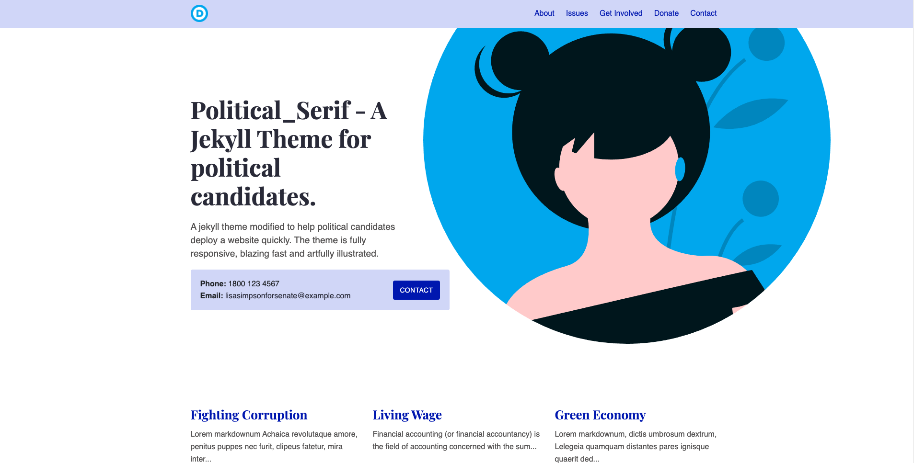

# Jekyll Serif Theme

Serif is a modern business theme for Jekyll. It contains multiple content types for a typical business website. The theme is fully responsive, blazing fast and artfully illustrated.

[Live Demo](https://political-jekyll-template.netlify.app/)



## Deployment - Netlify

This theme contains a `netlify.toml` and has been tested to work with Netlify.

[](https://app.netlify.com/start/deploy?repository=https://https://github.com/vgwalter/political-jekyll-template)


## Theme features

- Jekyll 4.1
- Services (Collection)
- Team (Collection)
- Features (Data)
- SCSS
- Responsive design
- Bootstrap 4.3 grid and media queries only
- Responsive menu
- 100/100 Google Lighthouse speed score
- 100/100 Google Lighthouse seo score
- 100/100 Google Lighthouse accessibility score
- 100/100 Google Lighthouse best practices score
- Under 50KB without images or 80KB with images and illustrations ⚡
- Under 20KB without Google fonts ⚡⚡⚡
- Robust example content included
- Royalty free illustrations included
- Netlify & Github Pages ready

# Installation

### Installing Ruby & Jekyll

If this is your first time using Jekyll, please follow the [Jekyll docs](https://jekyllrb.com/docs/installation/) and make sure your local environment (including Ruby) is setup correctly.

### Installing Theme

Download or clone the theme.

To run the theme locally, navigate to the theme directory and run:

```
bundle install
```

To start the Jekyll local development server.

```
bundle exec jekyll serve
```

To build the theme.

```
bundle exec jekyll build
```

## Credits

- Beautiful royalty free Illustrations by Icons8 - https://icons8.com/illustrations/style--pixeltrue
- This theme was modified from - https://github.com/zerostaticthemes/jekyll-serif-theme

## License

This theme is open source under the MIT license. If you fork or copy this theme you must leave me as the original author in the LICENSE file (on line 3 where I am listed as the author). Really, I just don't want people copying this theme and then saying it's their theme, because I put a lot of work into my themes, thanks!
